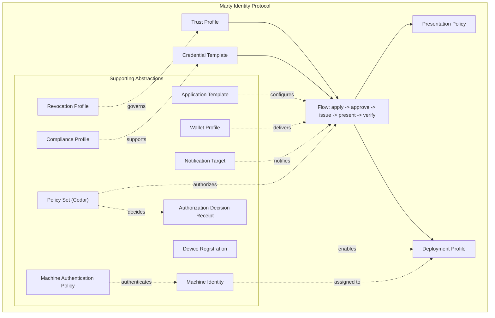

# Marty Identity Protocol (MIP)

  

**MIP Version:** 0.5.0 | **Status:** Draft

The **Marty Identity Protocol (MIP)** is a formal specification for representing, issuing, and verifying digital identity credentials. MIP defines the minimum set of automatable primitives required to make digital identity management repeatable, secure, and deployable across real-world environments.

MIP also supports managed machine identities used by secure document and identity infrastructure. It authenticates the actor and records identity-bound authorization decisions while leaving external resources, execution controls, and domain workflows under their owning systems.

---

## Architecture



---

## Core Model

> **Digital identity management can be represented by:**
> **Trust Profiles + Credential Templates + Presentation Policies + Deployment Profiles, orchestrated by Flows.**

This model maps several international standards into shared protocol objects while keeping the evidence level explicit. Active mappings and reserved drafts are not equivalent: the ICAO MRZ, ePassport, and DTC profiles remain non-discoverable drafts until format-native conformance coverage exists.

### Five Core Primitives

| Primitive | Purpose | Stability | Owner |
|-----------|---------|-----------|-------|
| **Trust Profile** | Who is trusted; how cryptographic validation occurs | Stable | Security |
| **Credential Template** | What is issued; schema + compliance + crypto + validity | Moderate | Program/Compliance |
| **Presentation Policy** | What must be shown; minimum disclosure + ZK predicates | Dynamic | Business/Compliance |
| **Deployment Profile** | Where it runs; lanes + devices + network mode + UX | Operational | Operations |
| **Flow** | How identity moves; apply -> approve -> issue -> present -> verify | Per use-case | All stakeholders |

### Supporting Abstractions

| Abstraction | Purpose |
|-------------|---------|
| **Compliance Profile** | Abstract credential format complexity (ICAO, AAMVA, EUDI, Enterprise) |
| **Application Template** | User-facing application workflows (forms, evidence, approvals) |
| **Revocation Profile** | Format-agnostic revocation configuration |
| **Wallet Profile** | Wallet compatibility and credential delivery configuration |
| **Device Registration** | User device registry for push notification delivery |
| **Machine Identity** | Managed non-human identity, keys, credentials, assignments, and lifecycle |
| **Machine Authentication Policy** | Machine proof-of-control and optional attestation requirements |
| **Authorization Decision Receipt** | Signed identity-bound authorization result for an opaque external operation |
| **Notification Target** | Multi-channel message propagation (FCM, SSE, Webhook, Email) |
| **Policy Set (Cedar)** | Formally verifiable authorization policies, including managed-machine authorization |

---

## Repository Structure

```
marty-protocol/
  SPECIFICATION.md              # MIP normative specification
  VERSIONING.md                 # Versioning policy
  CHANGELOG.md                  # Release history
  CONTRIBUTING.md               # Contribution guidelines
  LICENSE                       # Apache 2.0
  protocol/                     # Per-entity detailed specifications
    trust-profile/
    credential-template/
    presentation-policy/
    deployment-profile/
    flow/
    compliance-profile/
    application-template/
    revocation-profile/
    wallet-profile/
    device-registration/
    machine-identity/
    machine-authentication-policy/
    authorization-decision-receipt/
    notification-target/
  schemas/                      # JSON Schemas for all entities
  enums/                        # Documented controlled vocabularies
  cedar/                        # Cedar policy schema and reference policies
    mip.cedarschema             # MIP Cedar entity/action schema
    policies/                   # Reference Cedar policies
  examples/                     # Structured example corpus
    minimal/                    # Simplest valid documents
    realistic/                  # Complete use cases
    advanced/                   # ZK predicates, offline, multi-lane
  conformance/                  # Validation test suite
    valid/                      # Valid fixture documents
    invalid/                    # Invalid fixtures with .expected.json sidecars
  compliance-profiles/          # Standard-specific mappings
    icao/                       # ICAO Digital Travel Credentials
    aamva/                      # AAMVA Mobile Driver's License
    eudi/                       # EU Digital Identity Wallet
    enterprise/                 # Generic enterprise credentials
  reference/                    # Reference implementations
    rust/                       # mip-types crate + validation + CLI
    python/                     # Pydantic models + validation
    typescript/                 # Zod schemas + types
  docs/                         # Design docs and guides
    decisions/                  # Architecture Decision Records (ADRs)
  scripts/                      # Tooling
```

---

## Key Principles

- **Policies are data.** Endpoints execute them, not re-implement them.
- **Authorization is formally verifiable.** Cedar policies express access control, trust evaluation, and approval decisions.
- **Trust is explicit.** Cryptographic validation rules are declared, not assumed.
- **Disclosure is minimal.** Present only what is required; prefer predicates over raw values.
- **Deployment is declarative.** Device behavior is configured, not coded.
- **Flows make it automatable.** Sequence, state, and audit are managed by the protocol.

---

## Use Cases

- Pre-border / pre-boarding screening
- Mobile Driver's License (mDL) issuance and verification
- Age verification with zero-knowledge predicates
- Employee credential issuance and access control
- EU Digital Identity Wallet integration
- Cross-jurisdictional credential interoperability

---

## Standards Alignment

| Standard | Coverage |
|----------|---------|
| ISO/IEC 18013-5:2021 (mDL) | mDoc credential format, mdoc proximity presentation |
| ICAO Doc 9303 / DTC | Reserved draft mappings for MRZ text, TD3 eMRTD data and PKI, and DTC virtual components; no active ICAO conformance claim |
| OpenID for Verifiable Credential Issuance (OID4VCI) | Issuance protocol (pre-auth + auth code flows) |
| OpenID for Verifiable Presentations (OID4VP) | Presentation protocol, request/response |
| W3C Verifiable Credentials Data Model | VC-JWT, JSON-LD credentials |
| IETF SD-JWT-VC | Selective disclosure credentials |
| W3C DID Core | Decentralized identifier resolution |
| EUDI Wallet Architecture (ARF) | EU regulatory alignment |
| AAMVA mDL Implementation Guidelines | North American driver's license compliance |

---

## Specification

The canonical normative document is [SPECIFICATION.md](SPECIFICATION.md).

> **Note on schema URIs:** All JSON Schema `$id` fields use `https://raw.githubusercontent.com/marty-protocol/marty-protocol/main/` as the base URI. For local development, use the registry in [tests/helpers.py](tests/helpers.py) or the reference implementation validators in `reference/`.

---

## License

Apache 2.0 - see [LICENSE](LICENSE).

Originally created by Elevenid LLC. Copyright 2026 The MIP Authors.

---

## Contributing

See [CONTRIBUTING.md](CONTRIBUTING.md). All contributors must sign off their commits per the [Developer Certificate of Origin](https://developercertificate.org/).

Please review the [Code of Conduct](CODE_OF_CONDUCT.md) and [Governance](GOVERNANCE.md) before participating.

To report security vulnerabilities privately, see [SECURITY.md](SECURITY.md).
